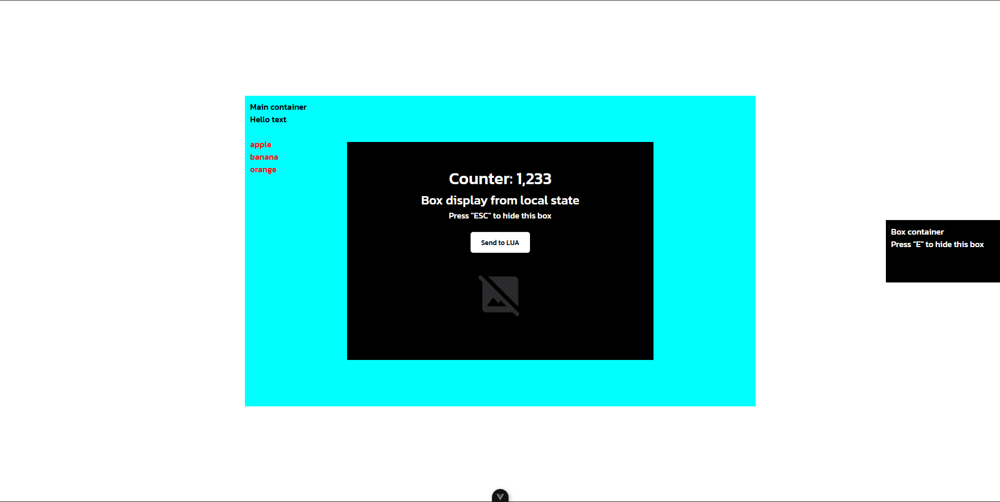

# Vue FiveM Template UI (example)

A Vue 3 + Vite template for building FiveM UI interfaces.

## Requirements

**Node.js** v20.x or higher

## Install

```sh
npm install
```

## Development

```sh
npm run dev
```

## Build

```sh
npm run build
```

Output files are in the `dist` directory.

## Lua Integration

### Sending Messages to NUI

```lua
SendNUIMessage({
    action = "DISPLAY",
    show = true,
    text = "some text",
})

SendNUIMessage({
    action = "DISPLAY_BOX",
    show = true,
})
```

### Receiving Data from NUI

```lua
RegisterNUICallback('RECIVE_DATA', function(data, cb)
    print('Data from NUI:', data.exampleData)
    cb('ok')
end)
```

## fxmanifest.lua Configuration

```lua
fx_version 'adamant'
game 'gta5'

version '1.0.0'

ui_page "html/index.html"

files {
    'html/index.html',
    'html/css/*.css',
    'html/js/*.js',
    'html/**/*.png',
}

client_scripts {
    'client.lua'
}

server_scripts {
    'server.lua'
}
```

## Preview

